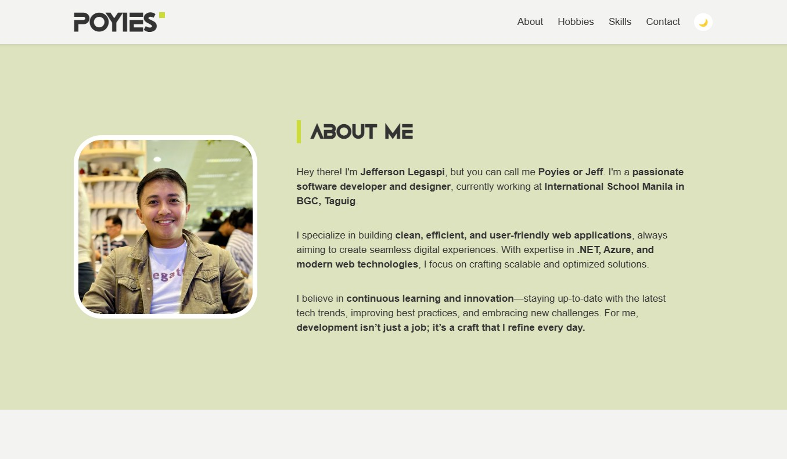
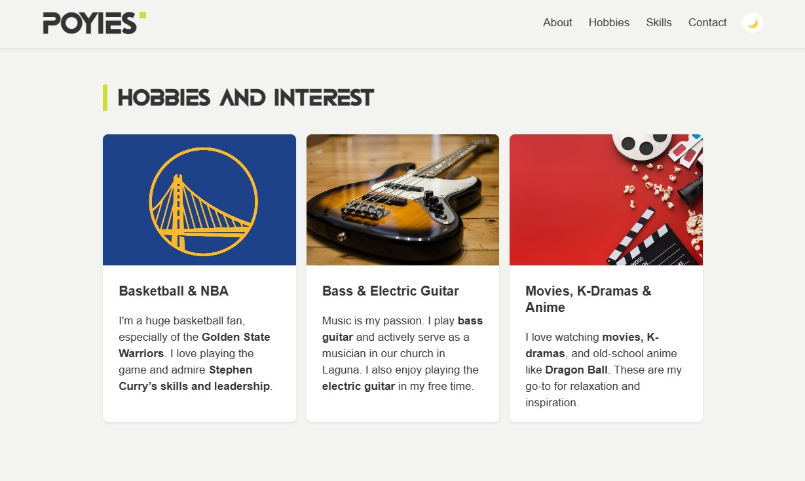
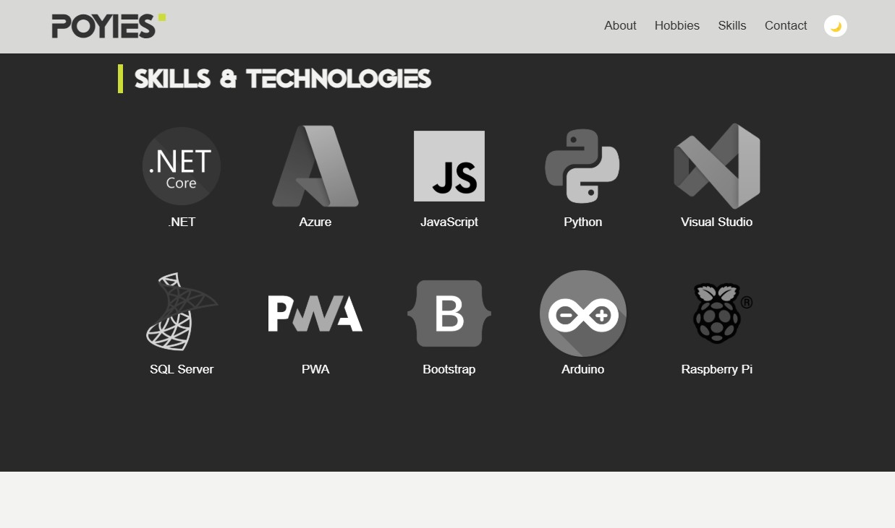
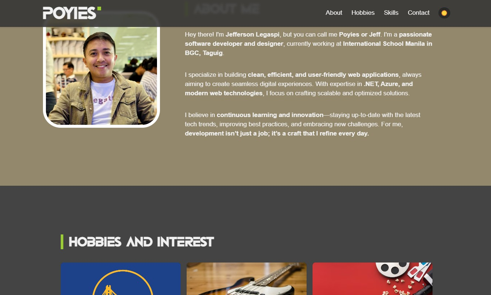
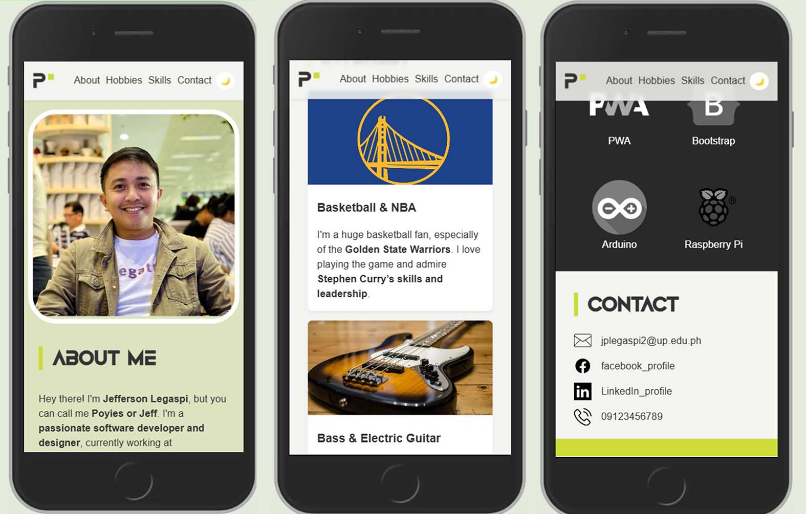

# **CMSC 207 Mini-Project: Personal Web Profile**
** Live Demo:** [Poyies Personal Web Profile](https://poyies.netlify.app/)  
** GitHub Repository:** [Poyies.netlify.app](https://github.com/Poyies/poyies.netlify.app)  

---

## **Project Overview**
This project is part of the CMSC 207 Web Programming and Development course, inspired by *Create with Code: Build Your Own Website* by Clyde Hatter.  

The goal is to create a **personal web profile** that applies **semantic HTML structure, CSS styling, JavaScript interactivity**, and ensures **responsiveness** across devices.

---

## **Project Objectives**
By completing this project, I have:
- Developed a **structured and semantic** HTML page.
- Applied **CSS styling** for enhanced layout, colors, and typography.
- Used **JavaScript for interactivity** (Dark Mode toggle, fun fact display).
- Implemented **responsive design** for mobile and desktop.
- Practiced **debugging and optimizing** a web page.

---

## **Website Structure**
The website consists of the following sections:

1. **Header**
   - Displays **name**, **site title**, and a **navigation menu**.
  
2. **About Me**
   - A short introduction **with a profile image**.
  
3. **Hobbies & Interests**
   - Lists at least **three hobbies with descriptions**.
  
4. **Skills & Technologies**
   - Displays **tech skills** with icons and hover effects.
  
5. **Contact Info**
   - Includes an **email address and social media links**.

---

## **Technologies Used**
| Technology  | Description |
|------------|-------------|
| **HTML5**  | Uses **semantic tags** (`<header>`, `<section>`, `<footer>`, etc.) for structure. |
| **CSS3**   | **External stylesheet** for styling, hover effects, and responsiveness. |
| **JavaScript** | Adds **interactivity** (Dark Mode toggle, fun fact display). |
| **Netlify** | **Deployed on Netlify** for easy hosting and sharing. |
| **GitHub** | Version control and repository hosting. |

---

## **Features & Enhancements**
**Navigation Menu** – Simple top menu with smooth scrolling.  
**Hover Effects** – CSS styling changes on buttons & images.  
**JavaScript Interaction** – Clicking the **profile image** shows a **random fun fact**.  
**Dark Mode Toggle** – Users can switch between **light & dark themes**.  
**Mobile-Friendly Layout** – Uses **CSS media queries** to adapt to different screen sizes.  

---

## **Screenshots**

---

## **Author**
**Jeff Legaspi**  
**Email:** [jplegaspi2@up.edu.ph](mailto:jplegaspi2@up.edu.ph)  
**Live Site:** [Poyies Personal Web Profile](https://poyies.netlify.app/)  
**GitHub:** [Poyies](https://github.com/Poyies)  

